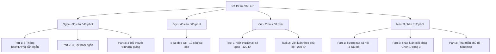

# KẾ HOẠCH TRIỂN KHAI PHÂN HỆ TẠO ĐỀ & CHẤM THI TỰ ĐỘNG (TOEIC & B1 VSTEP)
**Tài liệu Phân tích Nghiệp vụ (BA) - Báo cáo Ban Giám hiệu / Ban Quản lý Dự án**

Tài liệu này được biên soạn bởi đội ngũ Phân tích Nghiệp vụ (BA) nhằm cụ thể hóa yêu cầu nghiệp vụ và kế hoạch triển khai phân hệ **Tự động hóa Ngân hàng đề thi và Chấm thi trực tuyến** cho hai chứng chỉ **TOEIC (2 kỹ năng)** và **B1 VSTEP (4 kỹ năng)** tại Đại học Thành Đông.

---

## 1. Mục tiêu Dự án & Phạm vi Triển khai

### 1.1 Mục tiêu chính
- Xây dựng hệ thống quản lý ngân hàng câu hỏi tập trung.
- Sinh tự động **100 bộ đề thi chuẩn hóa độc lập** cho mỗi chứng chỉ (100 đề TOEIC và 100 đề B1) đáp ứng đúng quy chuẩn về cấu trúc đề, phân bổ độ khó và không trùng lặp nội dung.
- Phục vụ tổ chức thi và chấm thi tự động: trắc nghiệm (chấm ngay bằng quy tắc hệ thống) và tự luận nói/viết (chấm bằng mô hình trí tuệ nhân tạo AI).

### 1.2 Phạm vi nghiệp vụ
- **TOEIC:** 2 Kỹ năng (Listening & Reading) - 200 câu hỏi trắc nghiệm/đề.
- **B1 (Chuẩn VSTEP):** 4 Kỹ năng (Listening, Speaking, Reading, Writing).

---

## 2. Phân tích Dữ liệu Đầu vào Hiện có

Đội ngũ BA đã thực hiện giải nén, phân tích cấu trúc dữ liệu thô do đối tác cung cấp nhằm đưa ra phương án xử lý dữ liệu tự động.

### 2.1 Ngân hàng Đề TOEIC (`ĐỀ TOEIC.zip`)
Dữ liệu thô của TOEIC được lưu trữ tương đối ngăn nắp theo cấu trúc kỹ năng:
- **Phân hệ Nghe (Listening):**
  - **Đề thi:** Các file từ `LT2601.docx` đến `LT2629.docx` (chỉ gồm các số lẻ) lưu dưới dạng tài liệu Word chứa câu hỏi và các phương án lựa chọn.
  - **Đáp án:** Các file Excel tương ứng từ `Key LT2601.xlsx` đến `Key LT2629.xlsx`.
  - **Âm thanh:** Thư mục `File nghe tong hop` chứa các tệp âm thanh tương ứng với từng phần nghe của đề.
- **Phân hệ Đọc (Reading):**
  - **Đề thi:** Các file Word từ `CDR TOEIC - RT2601.doc` đến `CDR TOEIC - RT2615.doc` chứa văn bản đọc hiểu, câu hỏi điền từ và trắc nghiệm.
  - **Đáp án:** Các file Excel tương ứng như `KEY RT.2601.xlsx` đến `KEY RT.2615.xlsx`.

### 2.2 Ngân hàng Đề B1 (`B1 2601-2630.zip`)
Dữ liệu thô của B1 bao gồm 30 bộ đề hoàn chỉnh (mã từ 2601 đến 2630) được phân chia theo các nhóm thư mục:
- **Thư mục Đề thi:** Chia nhóm `2601-2610/`, `2611-2620/`, `2621-2630/`. Mỗi đề thi gồm 2 phần:
  - Phần Nghe: File Word `LB1.XXXX.docx` và tệp âm thanh tương ứng trong thư mục `FILE NGHE/`.
  - Phần Đọc & Viết: File Word `EB1 - XXXX.docx`.
- **Thư mục Nói (Speaking):** Thư mục `SPEAKING CARDS/` chứa các thẻ chủ đề thi nói tương ứng với từng đề (ví dụ: `Speaking card B1 - 2601 - 2610.doc`).
- **Thư mục Đáp án & Tiêu chí Chấm:**
  - Đáp án Nghe/Đọc: Nằm trong các thư mục con như `2601-2610-LIS/` chứa file biểu mẫu trả lời `Phiếu trả lời Listening B1 - XXXX.doc`.
  - Hướng dẫn chấm Viết & Nói: Các file mẫu phiếu điểm như `Phiếu chấm điểm B1 XXXX.docx` cung cấp thang điểm chi tiết, gợi ý đáp án (reference answers) và tiêu chí chấm điểm tự luận.

---

## 3. Quy chuẩn Cấu trúc Đề thi & Ma trận Đề

### 3.1 Cấu trúc Đề thi TOEIC (Nghe & Đọc)
Bài thi TOEIC gồm 2 phần thi lớn với 7 Parts, tổng cộng 200 câu hỏi trắc nghiệm làm trong 120 phút.

| Phần thi | Part | Số câu | Đơn vị câu hỏi | Mô tả nghiệp vụ | Phân bổ độ khó đề xuất |
|---|---|---|---|---|---|
| **Listening** | Part 1 | 6 | Câu đơn lẻ | Trắc nghiệm mô tả tranh (hình ảnh) | 2 Dễ / 3 Trung bình / 1 Khó |
| | Part 2 | 25 | Câu đơn lẻ | Hỏi & Đáp (3 đáp án lựa chọn A, B, C) | 6 Dễ / 13 Trung bình / 6 Khó |
| | Part 3 | 39 | Cụm 3 câu | 13 đoạn hội thoại nghe ngắn | 8 Dễ / 21 Trung bình / 10 Khó |
| | Part 4 | 30 | Cụm 3 câu | 10 bài nói ngắn độc thoại | 6 Dễ / 16 Trung bình / 8 Khó |
| **Reading** | Part 5 | 30 | Câu đơn lẻ | Điền vào câu chưa hoàn chỉnh | 8 Dễ / 15 Trung bình / 7 Khó |
| | Part 6 | 16 | Cụm 4 câu | Điền từ vào 4 đoạn văn | 3 Dễ / 8 Trung bình / 5 Khó |
| | Part 7 | 54 | Cụm 2-5 câu | Đọc hiểu đoạn văn Đơn / Kép / Ba | 9 Dễ / 28 Trung bình / 17 Khó |
| **Tổng cộng** | | **200** | | **Thời gian làm bài: 120 phút** | **25% Dễ - 50% Trung bình - 25% Khó** |

### 3.2 Cấu trúc Đề thi B1 VSTEP (Đề xuất Ma trận dựa trên Quy chế Bộ GD&ĐT)
Kỳ thi đánh giá năng lực tiếng Anh B1 VSTEP kiểm tra toàn diện 4 kỹ năng.



- **Kỹ năng Nghe (Listening):** 35 câu hỏi trắc nghiệm (gồm câu hỏi đơn và nhóm câu hỏi dựa trên hội thoại/bài giảng).
- **Kỹ năng Đọc (Reading):** 40 câu hỏi trắc nghiệm chia đều cho 4 bài đọc hiểu dài (khoảng 300-500 từ/bài).
- **Kỹ năng Viết (Writing):** 2 bài viết tự luận.
  - *Task 1:* Viết thư/email xã giao phản hồi (tối thiểu 120 từ).
  - *Task 2:* Viết bài luận nghị luận theo chủ đề (tối thiểu 250 từ).
- **Kỹ năng Nói (Speaking):** 3 phần thi nói thu âm trực tiếp qua thiết bị:
  - *Part 1:* Trả lời 3-6 câu hỏi ngắn về chủ đề quen thuộc (bản thân, gia đình, sở thích).
  - *Part 2:* Thảo luận lựa chọn giải pháp tốt nhất trong 3 lựa chọn cho trước kèm lập luận.
  - *Part 3:* Thuyết trình phát triển ý kiến dựa trên sơ đồ tư duy (mindmap) cho trước.

---

## 4. Phương án Nghiệp vụ & Kỹ thuật Chi tiết

### 4.1 Cơ chế Đọc và Nạp Dữ liệu Tự động (Parser Engine)
Để nhập liệu hàng chục đề thi từ file Word/Excel thô vào hệ thống mà không cần nhập thủ công bằng tay, hệ thống sẽ xây dựng **Bộ phân tách tài liệu thông minh (Smart Parser)**:
- **Đọc file Word (.docx, .doc):** Sử dụng thư viện backend phân tích cấu trúc tài liệu. Nhận diện các mẫu định dạng câu hỏi trắc nghiệm (ví dụ: `1. Question text... A. Option A... B. Option B...`) và các thẻ đánh dấu đoạn văn hoặc chèn ảnh.
- **Đọc file Excel (.xlsx):** Sử dụng các thư viện phân tích bảng dữ liệu Excel để tự động đọc cột Câu hỏi, Cột Đáp án Đúng và đối chiếu nạp vào cột `reference_answer` trong database.
- **Liên kết tài liệu nghe:** Tự động phát hiện liên kết tên tệp âm thanh trong tài liệu và map trực tiếp với file MP3 tương ứng trong thư mục tài liệu nghe được upload lên hệ thống.

### 4.2 Thuật toán Sinh và Trộn đề Tự động (100 Bộ đề)
Mục tiêu là tạo ra 100 bộ đề thi độc lập cho mỗi chứng chỉ để phòng khảo thí sử dụng ngẫu nhiên. Quy trình sinh đề được thực hiện như sau:

```text
Ngân hàng Câu hỏi Gốc (Dữ liệu thô đã nạp)
       │
       ├─ Standalone Questions (Part 1, 2, 5) ──► Trộn ngẫu nhiên cấp độ câu hỏi
       │
       └─ Group Questions (Part 3, 4, 6, 7)    ──► Trộn cấp độ Nhóm (Không tách rời câu hỏi con)
       │
       ▼
Thuật toán lọc và kiểm tra ràng buộc ma trận (QC)
       │
       ├─ Độ khó (Easy 25% / Medium 50% / Hard 25%)
       ├─ Tránh lặp lại chủ đề liên tiếp
       ├─ Tỷ lệ đáp án đúng phân bổ hài hòa (A/B/C/D)
       │
       ▼
Xuất bản 100 Bộ đề thi chuẩn hóa độc lập lưu trữ trong Database
```

#### Các ràng buộc thuật toán bắt buộc:
1. **Ràng buộc Nhóm câu hỏi (Group Isolation):** Các câu hỏi trắc nghiệm đi theo đoạn văn (Part 6, 7) hoặc đoạn hội thoại (Part 3, 4) bắt buộc phải đi cùng nhau. Thuật toán xáo trộn sẽ trộn ở cấp độ Nhóm (Group-level shuffling), không được phép tráo đổi câu hỏi con của nhóm này sang nhóm khác.
2. **Ràng buộc Độ khó (Difficulty Target):** Tỷ lệ câu hỏi Dễ, Trung bình, Khó trong đề thi sinh ra phải bám sát định mức đã cấu hình (lệch tối đa ±2 câu/phần).
3. **Ràng buộc Kiểm soát Chất lượng (QC Check):** Không lặp lại cùng một chủ đề (topic domain) quá 20% trong toàn bộ bài thi. Đảm bảo tỷ lệ phân bổ đáp án đúng cân bằng (ví dụ: đáp án A chiếm từ 20% - 28% tổng số câu hỏi, tránh việc một đáp án xuất hiện quá nhiều gây mất tính khách quan).

### 4.3 Quy trình Chấm thi Tự động (Automated Grading Flow)
- **Đối với trắc nghiệm (TOEIC L&R, B1 Listening/Reading):**
  - Hệ thống tự động so khớp lựa chọn của thí sinh với đáp án chuẩn (`reference_answer`) lưu trong cơ sở dữ liệu.
  - Tính tổng số câu đúng và quy đổi trực tiếp qua bảng quy đổi điểm chuẩn lưu trữ dưới dạng JSON trên hệ thống. Trả kết quả điểm số tức thời ngay sau khi thí sinh nộp bài.
- **Đối với tự luận Nói & Viết (B1 Speaking/Writing):**
  - Sử dụng mô hình **Gemini 1.5 Flash** (hoặc GPT-4) được cung cấp prompt chuyên biệt chuẩn hóa theo thang đánh giá VSTEP.
  - *Đầu vào chấm nói:* Hệ thống nén file ghi âm dạng nhẹ (Opus/WebM) gửi trực tiếp qua API kèm prompt chấm thi. AI thực hiện chuyển giọng nói thành văn bản (Transcribe), chấm điểm phát âm (Pronunciation), độ trôi chảy (Fluency), ngữ pháp sử dụng (Grammar) và từ vựng (Vocabulary).
  - *Đầu vào chấm viết:* Văn bản viết luận của thí sinh được AI phân tích lỗi chính tả, cấu trúc câu, tính mạch lạc và đưa ra phản hồi sửa lỗi chi tiết (Grammar & Structure correction).

---

## 5. Kế hoạch Phát triển & Lộ trình Triển khai (Roadmap)

Dự án được chia làm 5 giai đoạn chính nhằm đảm bảo tính chính xác và chất lượng đầu ra cao nhất.

### Giai đoạn 1: Nạp liệu và Quản lý dữ liệu gốc (Tuần 1)
- Thiết lập hệ thống cơ sở dữ liệu nâng cấp (Hỗ trợ nhóm câu hỏi, tài liệu đính kèm).
- Phát triển module parser thông minh đọc dữ liệu từ tệp Word (.docx) và Excel (.xlsx) của TOEIC và B1 thô để đưa vào ngân hàng dữ liệu gốc.
- Tạo giao diện xem và chỉnh sửa ngân hàng câu hỏi dành cho Giáo viên.

### Giai đoạn 2: Xây dựng Công cụ trộn đề & Sinh 100 Bộ đề mẫu (Tuần 2)
- Triển khai thuật toán sinh đề ngẫu nhiên đáp ứng ma trận ràng buộc độ khó và kiểm soát chất lượng (QC).
- Thực hiện chạy thuật toán sinh đề hàng loạt để tạo ra **100 bộ đề thi TOEIC** và **100 bộ đề thi B1** cố định lưu trữ trong database.
- Cung cấp giao diện quản trị cho Phòng Khảo thí duyệt đề, lựa chọn bộ đề cụ thể áp dụng cho kỳ thi.

### Giai đoạn 3: Phát triển Giao diện Phòng thi & Thu thập Bài làm (Tuần 3)
- Thiết kế giao diện làm bài thi trắc nghiệm (TOEIC, B1 Listening/Reading) dạng chia đôi màn hình trực quan cho thí sinh.
- Thiết kế giao diện viết luận và ghi âm bài nói trực tuyến.
- Tích hợp các bộ công cụ giám sát proctoring (khóa toàn màn hình, ghi hình camera giám sát, cảnh báo chuyển tab).
- Triển khai cơ chế tự động lưu bài làm (Auto-save) sau mỗi 30 giây tránh mất kết nối.

### Giai đoạn 4: Triển khai Động cơ Chấm thi AI & Quy đổi Điểm (Tuần 4)
- Hoàn thiện module chấm trắc nghiệm tự động và tra cứu bảng quy đổi điểm chuẩn.
- Cấu hình Prompt Engineering chi tiết cho mô hình AI Gemini thực hiện chấm thi Nói và Viết B1 theo đúng tiêu chuẩn VSTEP của Bộ Giáo dục.
- Thực hiện lưu trữ kết quả và trả điểm số kèm phản hồi chi tiết cho thí sinh.

### Giai đoạn 5: Kiểm thử Tải & Chạy Pilot thử nghiệm (Tuần 5)
- Giả lập tải thử nghiệm (Load testing) với 500 thí sinh làm bài và nộp bài đồng thời sử dụng các công cụ chuyên dụng.
- Tổ chức chạy thử nghiệm Pilot với nhóm 20 thí sinh thật tại trường để kiểm tra độ trễ âm thanh, camera giám sát và độ chính xác của AI.
- Nghiệm thu, bàn giao tài liệu kỹ thuật và vận hành cho Đại học Thành Đông.
